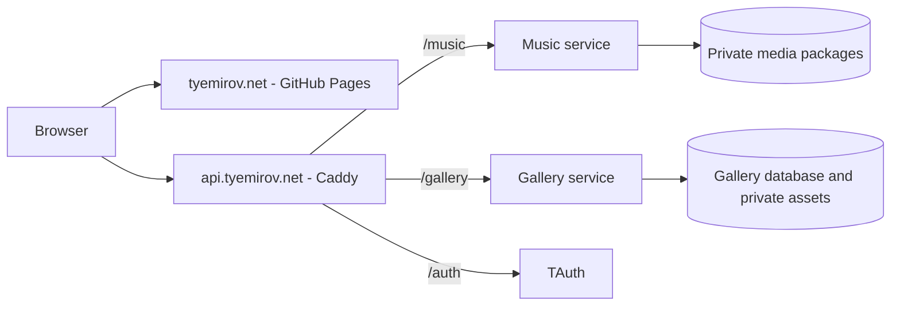

# Website And API Redesign

## Status And Scope

This design was prepared on September 10, 2026.
The user selected local full articles with source links.
The user also selected one API hostname for music and gallery services.
Implementation started on September 10, 2026.
The contracts below control implementation and qualification.
The [implementation record](redesign-implementation.md) lists completed changes, evidence, and remaining dependencies.
Production deployment remains unchanged.

The [Gallery Operating Plan](../gallery/OPERATING-PLAN.md) owns gallery product behavior.
This document owns the proposed site structure, shared API routes, and content contract changes.
For those subjects, this document replaces earlier hostname and hash-route proposals.
F002 remains the owner of Studio, purchases, and gallery publication.
I002, I003, I004, and I005 retain their existing acceptance criteria.

## Confirmed Requirements

| Subject | Selected value |
| --- | --- |
| Website | `https://tyemirov.net` |
| Public sections | `/music/`, `/gallery/`, `/articles/` |
| Articles | Full local text, with a visible source link |
| API origin | `https://api.tyemirov.net` |
| Gallery tenant | `tyemirov-gallery` |
| Studio owner | `vadym@tyemirov.net` |
| Google web client ID | `927328730595-fvjdq04oglsqm13ge2mmm3o0vf9mk4n0.apps.googleusercontent.com` |
| Tenant signing key | A new private value, already prepared for this tenant |
| Contract changes | Forward only, with bounded data migration |

The Google client export identifies project `temirov`.
The client ID above is public configuration.
The Google client secret is not an input to this design.

## Contract Gaps Before Implementation

| Source | Current behavior | Required change |
| --- | --- | --- |
| `data/site.json` | Separate `essays`, `arts`, `music`, and `gallery` shapes | One complete catalog schema with explicit references |
| `site.js` | Cards and navigation derive from several content shapes | Shared selectors over validated catalog data |
| `gallery/js/core/router.js` | Gallery addresses use URL fragments | Real static pages at canonical paths |
| `music/player-config.json` | Music uses `audio.tyemirov.net` | One generated public API config |
| `gallery/api-config.json` | Gallery uses `gallery-api.tyemirov.net` | The same generated public API config |
| `services/music-stream/internal/stream/server.go` | Grants use `/api/playback-grants`, media uses `/hls/` | Native `/music/` paths throughout the service |
| `services/gallery/contract.go` | Gallery resources use root paths | Native `/gallery/` paths throughout the service |
| `services/gallery/contract.go` | Reflection generates broad OpenAPI shapes | Explicit bounds, unions, errors, and operation responses |
| `scripts/build-pages-artifact.sh`, `Dockerfile.pages` | Explicit static file lists | Complete generated article and gallery pages |
| `.mprlab/deploy/resources.yml` | Separate music and gallery hostnames | One API route with separate service handlers |

The catalog contains article metadata and Substack links.
It does not contain the full article bodies.
Some album dates contain only a year.
Album notes currently contain both plain text and HTML.
These are content migration inputs, not reasons to infer missing facts.

## Deployment Structure

The website remains on GitHub Pages.
Caddy sends requests to separate services on the private network.
The existing gateway preserves each path prefix.
Each service owns its complete public paths.
The selected manifest needs no path rewrite field.

1. Replace the two application hostname routes with one `api.tyemirov.net` route.
2. Assign `/music` to `tyemirov-site.music-http`.
3. Assign `/gallery` to `tyemirov-site.gallery-http`.
4. Assign `/auth` to the verified TAuth HTTP capability.
5. Reject unmatched paths instead of assigning a default application service.
6. Update service readiness paths, capability health paths, and public health checks together.

The `tauth.tenants` capability contributes tenant configuration.
It does not identify the TAuth HTTP upstream.
The TAuth manifest identifies `tauth.http` as its HTTP capability.
The Google browser flow uses `/auth/nonce`, `/auth/google`, `/auth/session`, `/auth/refresh`, and `/auth/logout`.
TAuth owns those routes, including any necessary metadata or callback paths outside `/auth`.
The application must not invent or rewrite the shared authentication protocol.

## Website Routes

| Canonical path | Content or function | Build output |
| --- | --- | --- |
| `/` | Profile and selected project, article, music, and gallery cards | `index.html` |
| `/music/` | Album catalog | `music/index.html` |
| `/music/{albumSlug}/` | Album and player | `music/{albumSlug}/index.html` |
| `/articles/` | Full article catalog | `articles/index.html` |
| `/articles/{articleSlug}/` | Complete article and source link | `articles/{articleSlug}/index.html` |
| `/gallery/` | Exhibits and collections | `gallery/index.html` |
| `/gallery/exhibits/{exhibitId}/` | One exhibit | One generated `index.html` |
| `/gallery/collections/{collectionId}/` | One collection | One generated `index.html` |
| `/gallery/artworks/{artworkId}/` | One artwork | One generated `index.html` |
| `/gallery/about/` | Gallery introduction | `gallery/about/index.html` |
| `/gallery/cart/` | Current buyer selections | `gallery/cart/index.html` |
| `/gallery/order/?order={orderId}` | One private order after authorization | `gallery/order/index.html` |
| `/gallery/studio/` | Owner login and Studio | `gallery/studio/index.html` |

The order ID is a public resource identifier.
The order access secret remains outside the URL, browser history, and persistent browser storage.
The fixed order page avoids a generated page for each private order.

1. Generate a physical file for every public content route.
2. Generate page titles, descriptions, canonical URLs, and initial article text from the same catalog snapshot.
3. Generate a route manifest with each canonical path and its artifact file.
4. Reject route collisions, missing referenced files, and invalid slugs during the build.
5. Return a real error page for an unknown content path.
6. Delete gallery hash routes after the new pages and links pass validation.

GitHub Pages supports a [custom error page](https://docs.github.com/en/pages/getting-started-with-github-pages/creating-a-custom-404-page-for-your-github-pages-site).
This design does not depend on a server rewrite for unknown paths.
Browser history and reload must work for each generated page.

## Contract Ownership

The following paths own the implemented application contracts.

| Contract owner | Canonical source | Derived consumers |
| --- | --- | --- |
| Public content shape | `contracts/site.schema.json` | Catalog validation, build input types, browser boundary types |
| Shared gallery records | `contracts/gallery.schema.json` | Site schema references, gallery transport types, Studio types |
| Shared music records | `contracts/music.schema.json` | Site schema references, music transport types, player types |
| Gallery HTTP behavior | `contracts/gallery.openapi.yaml` | Router registration, client paths, request and response checks |
| Music HTTP behavior | `contracts/music.openapi.yaml` | Router registration, client paths, request and response checks |
| Public runtime shape | `contracts/site-runtime.schema.json` | Public config generator and browser bootstrap |
| Authentication | Published TAuth and `mpr-ui` contracts | `/config-ui.yaml` and the shared header |
| Production topology | `.mprlab/deploy/resources.yml` | Runtime arguments, gateway routes, public API origin |
| Public content values | `data/site.json` | Pages, card data, search metadata, publication input |
| Private gallery state | Gallery database schema | Drafts, masters, orders, entitlements, audit records |

Use [JSON Schema Draft 2020-12](https://json-schema.org/draft/2020-12) for application JSON contracts.
Use [OpenAPI 3.1](https://spec.openapis.org/oas/v3.1.1.html) with domain schema references for the two application APIs.
The current reflection generator must be removed when the explicit gallery contract becomes authoritative.

1. Close every object shape and define every required field.
2. Define null values, enums, bounds, formats, and discriminated alternatives explicitly.
3. Reject unknown fields, obsolete shapes, and unsupported alternatives at input boundaries.
4. Generate transport types and route bindings from the canonical contracts.
5. Keep cross-record rules in named boundary validators.
6. Let core modules consume validated domain values without repeated validation.
7. Verify generated artifacts against their source contracts during the repository build.
8. Keep provider payload schemas at their provider adapters.

A full schema is necessary for the entire catalog, including profile and navigation data.
A permissive root with only the new article fields checked does not satisfy this design.
Schema validation does not prove reference integrity, authorization, or purchased file identity.
Those rules require public integration tests at their owning boundaries.

## Public Content Model

### Catalog Structure

The target root contains `site`, `contact`, `hero`, `profile`, `mprlab`, `projects`, `articles`, `music`, and `gallery`.
The migration removes `essays` and the duplicated `arts.items` promotion records.
Gallery cards derive from `gallery` records.
The gallery gains `label` and `title` fields for the homepage section.
The migration moves those values from `arts` without duplicate promotion records.

`site`, `contact`, `hero`, `profile`, and `mprlab` retain their content responsibilities.
The complete schema must enumerate their current fields and nested objects.
Navigation stores site-absolute paths for local destinations.
Canonical page URLs derive from `site.canonical` and the route contract.
The derived gallery URL replaces the duplicated `gallery.siteUrl` field.

### Shared Rules

| Value | Target rule |
| --- | --- |
| ID | Permanent identity, unique within its resource type |
| Slug | Lowercase letters, digits, and single hyphens, with no path separators |
| Status | `draft` or `live` for editorial records |
| Ordered references | Array position defines membership order |
| Card order | Integer `order`, then stable ID as the tie breaker |
| Kicker | `AI`, `Modeling`, `Decisioning`, `Arts`, or `Writings` |
| Source label | Separate from the kicker, for example `MPR Lab` or `Substack` |
| Card theme | `copper`, `teal`, `olive`, `slate`, `amber`, `indigo`, or `violet` |
| Local public asset | Site-absolute path to an included artifact file |
| Optional absent fact | Explicit null where the schema permits absence |
| Timestamp | RFC 3339 UTC value when the source supplies a time |

Keep permanent music track IDs and gallery artwork IDs during migration.
Reject references to absent records and public references to drafts.
Exclude all drafts from the public artifact, including public JSON.
Keep source drafts in authoring inputs only.
The builder creates the public projection from the single catalog source.

The site schema defines separate `sourceCatalog` and `publicCatalog` entry points.
Each boundary selects exactly one entry point.
Shared record definitions supply their common fields.
The public article records omit bodies because the generated article HTML already contains the full text.
This keeps full article text out of catalog requests from the homepage, music player, and gallery.

The public projection also removes drafts and authoring-only fields.
Each input and output has one current schema.

### Articles

`articles` contains `label`, `title`, and an `items` array.
Each source item has the following closed shape.
Every listed field is required, including fields that permit null.

| Field | Type and constraints | Meaning |
| --- | --- | --- |
| `id` | Stable string, 1–80 characters | Article identity used by references |
| `slug` | Unique slug, 1–120 characters | Local page address |
| `title` | Plain text, 1–200 characters | Page and card title |
| `summary` | Plain text, 1–1000 characters | Catalog introduction |
| `kicker` | One shared kicker value | Global filter classification |
| `status` | `draft` or `live` | Publication selection |
| `order` | Nonnegative integer | Catalog order |
| `publishedAt` | UTC timestamp or null | Verified original publication time |
| `updatedAt` | UTC timestamp or null | Verified revision time |
| `source` | `{label, url}` | Visible original source label and absolute HTTPS URL |
| `body` | `{format: "commonmark", text}` | Complete local article text, 1–2,000,000 characters |
| `image` | `{src, alt, width, height}` or null | Local article image with positive pixel dimensions |

1. Store the full body in the article record in `data/site.json`.
2. Render [CommonMark](https://spec.commonmark.org/0.31.2/) with raw HTML disabled and an explicit URL scheme policy.
3. Reject scripts, executable embeds, and unsupported content during import.
4. Preserve text, headings, quotations, emphasis, code, lists, and source attribution.
5. Include referenced article images in the Pages artifact.
6. Require useful alt text for article images.
7. Keep image captions and inline image references in the body.
8. Preserve unknown publication times as null instead of inventing dates.
9. Put the complete article in the initial HTML response.
10. Show the Substack source link on the local article page.

The local page has its own canonical URL.
The source link records provenance and gives access to the original publication.
The article schema permits original local articles through a source URL equal to their canonical URL.
No article API or article database is necessary for this release.

### Projects And Series

Project cards remain in `projects` and render through `site.js`.
Each project has one explicit `kind`: `tool` or `series`.
Both kinds share identity, title, summary, kicker, source label, theme, status, and order fields.

| Kind | Additional fields | Behavior |
| --- | --- | --- |
| `tool` | Local `href`, `cta`, companion `sourceUrl` | Opens the existing tool page |
| `series` | `parts: [{articleId}]` | Shows an ordered hub of local articles |

The `parts` array owns series membership and order.
Articles do not duplicate a series position or a series URL.
Each part resolves to one live article before public output generation.
The series card acts as the hub and contains links to its parts.
The redesign does not require a separate series page.

### Music

Music remains an ordered album catalog with stable track IDs.
Album metadata and player availability have separate meanings.

1. Keep the existing album and track fields explicit in the music schema.
2. Replace ambiguous `releaseDate` strings with a discriminated `releaseDate` value.
3. Accept `{precision: "year", value: "2026"}` when only the year is known.
4. Accept `{precision: "day", value: "2026-09-10"}` when the full date is known.
5. Replace mixed HTML and text notes with `notes: {format: "commonmark", text}`.
6. Keep `playback` as `external` or `hls`, with duration required only for `hls`.
7. Require each HLS track to resolve to its private media package before publication.
8. Keep provider links as external listening destinations, independent of local HLS availability.

Public music metadata contains no storage path, master recording, or playback secret.
The browser receives playable resource URLs from the grant API.
The private media index remains a separate service contract.
The redesign does not change recording bytes or encode the media again.

### Gallery

The gallery retains normalized `artworks`, `collections`, and `exhibits` arrays.
Collection membership and exhibit sections refer to artwork IDs.
Each artwork retains one public image description and an explicit nullable sale offer.
The schema must preserve all offer fields, including price, currency, license, revision, file information, and delivery terms.

1. Define each gallery field once in the shared gallery schema.
2. Require covers to refer to artwork in their collection or exhibit.
3. Bound each crop coordinate from zero through 100.
4. Require valid exhibit dates with the start date before or equal to the end date.
5. Keep private master references outside the public gallery shape.
6. Keep the private draft shape as `{gallery, masters}` with an ETag.
7. Validate the master map and offer revisions together at the draft boundary.
8. Preserve purchased prices, licenses, and master revisions after later catalog changes.

The public catalog describes current offers.
An order contains an immutable purchase snapshot.
Publication does not rewrite existing orders or entitlements.
Artwork without an offer remains visible and cannot enter checkout.

## Public Runtime And Authentication

The website loads one application config at `/config-site.json`.
Its closed shape is `{apiOrigin}`.
For production, the value is `https://api.tyemirov.net`.
The value contains no path, query, fragment, user information, or secret.
API paths derive from the generated application contracts.

1. Generate `apiOrigin` from the selected API route in the deployment manifest.
2. Reject zero or multiple matching application API origins during generation.
3. Use the same origin for the music public-origin argument and gallery generated links.
4. Remove `music/player-config.json` and `gallery/api-config.json` during cutover.
5. Keep `/config-ui.yaml` as the shared authentication input.
6. Use the published nested `mpr-ui` authentication schema without an application-specific copy.
7. Require its TAuth origin to equal the application API origin.
8. Verify equality between the public Google client ID and the selected tenant input without disclosing private values.

The selected manifest remains versionless and uses only supported gateway fields.
Its tenant resource retains resource references for the Google client ID and signing key.
The public client ID is projected into browser configuration.
The signing key remains a private deployment input.

Studio uses the shared header and TAuth login behavior.
The gallery service authorizes the configured owner after tenant authentication.
An authenticated non-owner cannot read drafts, private assets, or owner order lists.
Password login is not a requirement for this design.

### Browser Boundaries

1. Keep music session cookies host-only on `api.tyemirov.net`, with `Path=/music`.
2. Keep separate names for music, gallery session, and gallery refresh cookies.
3. Set the TAuth cookie domain to `api.tyemirov.net` through the selected tenant contract.
4. Use `Path=/` for TAuth cookies needed by both `/auth` and `/gallery`.
5. Use `Secure`, `HttpOnly`, and the shared TAuth SameSite contract for authentication cookies.
6. Require the exact website origin for credentialed browser requests.
7. Expose required CORS headers, including `ETag`, `Location`, and `X-Request-ID`.
8. Validate the request origin for cookie-authenticated mutations.
9. Keep payment webhooks under provider verification instead of browser cookie authentication.
10. Keep buyer and download access in authorization headers with browser credentials omitted.

The proposed music cookie name is `__Secure-music-session`.
The current `__Host-music-session` name requires `Path=/` under the [cookie prefix rules](https://developer.mozilla.org/en-US/docs/Web/HTTP/Reference/Headers/Set-Cookie#cookie_prefixes).
It cannot be reused with `Path=/music`.
The new cookie remains host-only because the service omits the `Domain` attribute.

Cookie paths reduce unnecessary cookie transmission.
They do not replace resource authorization.
Cross-origin requests remain necessary because the website and API have different hostnames.
The Google provider must register the exact website origins used by production and local Studio.

## Application API Routes

All paths below are relative to `https://api.tyemirov.net`.
The application services receive these complete paths from Caddy.
Existing resource identities and stored purchase data remain stable.

### Music Resources

| Methods | Path | Contract |
| --- | --- | --- |
| `GET` | `/music/healthz` | Process health |
| `GET` | `/music/readyz` | Media readiness |
| `GET` | `/music/openapi.json` | Current music API schema |
| `POST` | `/music/playback-grants` | Create a grant for one track |
| `GET`, `DELETE` | `/music/playback-grants/{grantId}` | Read or revoke the session grant |
| `PUT` | `/music/playback-grants/{grantId}/expiration` | Replace the grant expiration |
| `GET`, `HEAD` | `/music/hls/{grantId}/{assetId}/{file}` | Authorized playlist, initialization file, or segment |

Update grant responses, playlist references, request logs, cookies, and URL validation with the route contract.
The `/api` segment is removed from the grant path.
The `/hls` segment remains within the music domain prefix.
An HLS resource still requires the matching browser session and an active grant.

### Gallery Resources

| Methods | Path | Access |
| --- | --- | --- |
| `GET` | `/gallery/readyz`, `/gallery/openapi.json` | Public |
| `GET`, `POST` | `/gallery/assets` | Owner |
| `GET` | `/gallery/assets/{assetId}` | Owner |
| `GET` | `/gallery/assets/{assetId}/{representation}` | Owner |
| `GET`, `PUT` | `/gallery/draft` | Owner |
| `POST` | `/gallery/publications` | Owner |
| `GET` | `/gallery/publications/{publicationId}/archive` | Owner |
| `POST` | `/gallery/orders` | Public checkout |
| `GET` | `/gallery/orders` | Owner |
| `GET` | `/gallery/orders/{orderId}` | Owner or authorized buyer |
| `PATCH` | `/gallery/orders/{orderId}` | Authorized buyer cancellation |
| `POST` | `/gallery/orders/{orderId}/captures` | Authorized buyer |
| `POST` | `/gallery/orders/{orderId}/download-links` | Authorized buyer |
| `POST` | `/gallery/orders/{orderId}/access-reissues` | Owner |
| `GET` | `/gallery/orders/{orderId}/access-reissues/{reissueId}` | Owner |
| `GET`, `HEAD` | `/gallery/downloads/{downloadId}` | Authorized download grant |
| `POST` | `/gallery/payment-events` | Verified payment provider |

### HTTP Contract Gate

1. Define each operation request, success response, error response, and access rule before handler changes.
2. Define `HEAD`, `OPTIONS`, CORS, `Allow`, and cache behavior for each applicable resource.
3. Use `{code, message, requestId}` for application JSON errors.
4. Define all pagination filters, ordering, limits, and `nextCursor` behavior.
5. Require `If-Match` for complete draft replacement and return `412` for a stale ETag.
6. Require idempotency for orders, captures, publication creation, and access reissues through explicit operation rules.
7. Document the idempotency scope, request comparison, lifetime, and concurrent retry result for each applicable operation.
8. Model queued work with a readable resource and explicit pending state.
9. Return `201` with `Location` for new synchronous resources and `202` for pending work.
10. Preserve payment verification, revocation, byte ranges, checksums, and download expiration behavior.
11. Generate all returned links from the same origin and path contracts as router registration.
12. Reject old unprefixed paths and unsupported methods through the real service listener.

The gateway does not unify the two service databases or error implementations.
The application contracts define common HTTP semantics at their public boundaries.
TAuth errors and provider payloads retain their owning contracts.

## Website Presentation

The homepage retains a compact profile and section navigation.
The Writing link opens `/articles/`.
Music and Arts open `/music/` and `/gallery/`.
Article pages prioritize readable text, section headings, images, and source attribution.
Gallery pages prioritize images and clear exhibit or collection context.

1. Render project cards through `site.js` and `data/site.json`.
2. Connect kicker and source tags to `window.toggleProjectFilter(tag)`.
3. Use shared content selectors for homepage cards and section pages.
4. Include `mpr-header` on internal pages.
5. Initialize `mpr-footer` with the shared footer site catalog.
6. Include the mandatory tracking script first in each generated HTML head.
7. Include the standard face favicons and preserve brand spelling rules.
8. Preserve prominent Substack companion links on supporting tool pages.
9. Preserve I002 through I005 layout, focus, refresh, and spacing requirements.
10. Verify article pages and gallery navigation at phone, tablet, and desktop widths.

## Publication Consistency

A gallery draft, a publication candidate, and a deployed catalog are different states.
Studio saves private drafts through the gallery API.
The owner exports a reviewed publication archive.
The repository import updates only the gallery part of `data/site.json` and its public images.
The complete catalog remains the source for the website artifact.

1. Associate each candidate with its draft ETag and `baseCatalogDigest` from the currently selected public catalog.
2. Reject an import when the current catalog differs from the expected catalog.
3. Build Pages and the gallery public catalog from the same selected snapshot.
4. Verify the selected snapshot before purchases can use new offers.
5. Preserve old purchase snapshots independently of the selected public catalog.
6. Revalidate a changed catalog at browser reentry under I004.
7. Prevent checkout against a stale offer revision and require the buyer to review changed terms.

The content digest identifies the exact UTF-8 bytes of the generated public catalog.
Both the gallery service and browser calculate it from those bytes.
The build calculates a new digest after the reviewed import.
The base digest controls import concurrency, while the new digest controls checkout consistency.

The proposed order input is `{offerIds, email, catalogDigest}`.
For a new order, a digest mismatch returns `409` with code `catalog_changed`.
The browser then reloads the catalog and requires another buyer review.
An identical idempotent retry returns the original order, even after a catalog change.

Pages and API deployment are separate operations.
They cannot form one distributed transaction.
The initial cutover uses a controlled interval with purchases and Studio writes disabled.
Old open browser pages can fail after cutover and must require a reload.
The design provides no old endpoint aliases or simultaneous schema readers.

## Migration And Execution Order

### Phase 1: Complete The Contracts

1. Write the complete site, gallery, music, runtime, and HTTP schemas listed above.
2. Define each generated artifact and its repository-owned generation command.
3. Build a representative valid catalog with complete articles, a series, albums, and gallery records.
4. Verify invalid references, unknown fields, route collisions, and private field exclusion through the build entry point.
5. Resolve every unbounded field and ambiguous response before dependent implementation begins.

This phase is the implementation entry gate.
An architecture document or a partial schema alone does not satisfy it.

### Phase 2: Migrate Content And Generate Pages

1. Obtain complete source articles and record their verified source links.
2. Prepare a bounded migration report for every existing catalog record.
3. Preserve artwork IDs, track IDs, article text, and known publication facts.
4. Convert article metadata, series references, album dates, and album notes into the target shapes.
5. Fail the migration for absent full articles or unresolved references.
6. Generate the complete static site and public catalog projection.
7. Validate the actual Pages artifact and each direct page request.
8. Remove the obsolete content shapes and the completed migration bridge.

### Phase 3: Move The API Contract

1. Add failing integration tests for the new paths through the existing gateway behavior.
2. Change service routers, generated links, clients, cookies, config generation, and health checks together.
3. Configure the unified local API origin through the existing local orchestration entry point.
4. Keep local persistent media, gallery data, payment infrastructure, and email infrastructure.
5. Verify native HLS, JavaScript HLS, gallery publication, purchases, and downloads through the unified origin.
6. Reject the obsolete service hosts in selected config and old root paths in service tests.

The local website and API use separate HTTPS origins, as production does.
One local API proxy sends complete prefixes to the separate services.
Provider credentials remain outside tracked configuration and generated artifacts.

### Phase 4: Complete Studio And Shared Dependencies

1. Verify the published nested `mpr-ui` authentication contract before Studio implementation depends on it.
2. Resolve the TAuth HTTP capability and exact provider origins.
3. Build Studio against the generated gallery client and shared authentication components.
4. Verify denied access, owner access, upload, draft conflicts, export, orders, and access reissue.
5. Complete the required internal browser review and shared footer qualification.

### Phase 5: Qualify And Cut Over

1. Run the final `make ci` checkpoint after the last stack change, as required by repository policy.
2. Qualify the new music, gallery, and Pages artifacts as one selected release set.
3. Record the active catalog digest, retained data locations, and verified gallery backup.
4. Disable new purchases and Studio writes before the first production contract replacement.
5. Apply bounded database migrations only when the selected schema requires them.
6. Deploy the prefixed APIs, tenant routes, health checks, and generated public config.
7. Publish the matching Pages artifact through the repository lifecycle.
8. Verify public routes, release evidence, authentication, catalog agreement, media, and purchased file access.
9. Enable purchases and Studio writes only after their production prerequisites pass.
10. Remove obsolete route resources and migration code without changing historical sealed evidence.

If a cutover check fails, keep affected writes disabled and repair the current contract.
Do not enable old schema readers or restore old API aliases.
Backup recovery must preserve the current schema and any accepted purchase records.
Production lifecycle operations require their own operator instruction.

## Acceptance Criteria

| Boundary | Required evidence |
| --- | --- |
| Catalog | Complete schema, semantic reference validation, no public draft or private data |
| Articles | Full initial HTML, preserved source text, local images, visible source links |
| Pages | Direct navigation, reload, history, correct canonical URLs, real unknown-page errors |
| Build | Every route file in both local and container Pages artifacts |
| Runtime config | One API origin, closed shape, exact agreement with the selected deployment |
| Music | Grant creation, expiration, revocation, native HLS, JavaScript HLS, range responses |
| Gallery | Owner isolation, ETags, publication import, catalog agreement, order idempotency |
| Purchases | Verified capture, refund or reversal, access reissue, exact purchased revision, receipt retry |
| Shared origin | CORS, cookie scope, returned links, prefix dispatch, denied root paths |
| Authentication | Published shared contract, correct tenant, owner and non-owner checks |
| Presentation | I002 through I005 checks, keyboard navigation, internal browser review |
| Cutover | Matching release artifacts, retained data, public health checks, write-enable gates |

Local provider tests prove application behavior against the selected local protocols.
They do not prove live Google, PayPal, or Pinguin acceptance.
Production qualification remains a separate recorded result.

## Open Inputs And Dependencies

| Input or dependency | Required before |
| --- | --- |
| Full article bodies, embedded images, and verified dates where available | Content migration |
| Verified series membership for existing essays | Series migration |
| Published nested `mpr-ui` auth contract and shared footer changes | Studio acceptance and I005 completion |
| Actual TAuth HTTP capability and required route set | Shared authentication routing |
| Exact local Studio origin registered in Google | Local Google acceptance |
| DNS and TLS qualification for `api.tyemirov.net` | Production cutover |
| Owner-selected masters, prices, license, and delivery terms | Active sale offers |
| Verified PayPal and Pinguin deployment inputs | Production purchase and receipt acceptance |
| Available internal browser review environment | Required visual acceptance |

The article location and full-text choice are resolved requirements.
Missing source bodies are a content input, not an unresolved hosting decision.
The remaining dependencies do not prevent review of this design.
